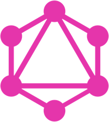

---?image=images/bg-code.jpg&size=cover



## GraphQL
##### A Practical Introduction

---
# GraphQL
<span style="color: #777">*is a new API standard that provides a more efficient, powerful and flexible alternative to REST*</span>

---
# GraphQL
<span style="color: #777">*a query language for APIs - not databases.*</span>

---
### Practical Definition of Terms

+++
# API
<span style="color: #777">is an interface that allows you to use an application.</span>

+++
# REST
<span style="color: #777">is way of structuring a Web API.</span>

+++
### Star Wars REST Example
[Star Wars API](https://swapi.co/)

```
Request:
GET /people

Response:
{
  "count": 1
  "next": "",
  "previous": null,
  "results": [{
    "name": "Luke Skywalker",
		"height": "172",
		"mass": "77",
		"hair_color": "blond",
		"skin_color": "fair",
		"eye_color": "blue",
		"birth_year": "19BBY",
		"gender": "male",
    ...
		"created": "2014-12-09T13:50:51.644000Z",
		"edited": "2014-12-20T21:17:56.891000Z",
		"url": "http://swapi.co/api/people/1/"
	}]
}
```
@[1-2](Send GET request to /people endpoint)
@[4](Response)
@[6](Number of responses)
@[7](Link to next results)
@[8](Link to previous results)
@[9](Array of results)
@[10-21](Fields of a result)

+++
### Star Wars REST Example

```
Request:
GET /people/1

Response:
{
  "name": "Luke Skywalker",
  "height": "172",
  "mass": "77",
  "hair_color": "blond",
  "skin_color": "fair",
  "eye_color": "blue",
  "birth_year": "19BBY",
  "gender": "male",
  ...
  "created": "2014-12-09T13:50:51.644000Z",
  "edited": "2014-12-20T21:17:56.891000Z",
  "url": "http://swapi.co/api/people/1/"
}
```

@[1-2](Send GET request to /people/1 endpoint)
@[4](Response)
@[6-17](Fields of a result)

+++
### Star Wars GraphQL
[Star Wars GraphQL API](http://graphql.org/swapi-graphql/)

---
### A Better Alternative to REST
- Efficient   |
- Flexible    |
- Easy to use |
- Declarative |

+++
### GraphQL is EFFICIENT
<span class="fragment" style="color: #777">GraphQL allows the API consumers to just get what they need, which makes it more efficient than REST when mobile data is limited and/or the connectivity is weak.</span>

+++
### GraphQL is FLEXIBLE
<span class="fragment" style="color: #777">Because GraphQL allows API consumers to just get the data they need, it can be used by any client, no matter what the framework or platform.</span>

+++
### GraphQL is EASY TO USE
<span class="fragment" style="color: #777">With changes in API specifications, *REST* APIs might need to change drastically, too. **GraphQL** allows faster modification and creates a predictable API allowing for rapid development.</span>

+++
### GraphQL is DECLARATIVE
<span class="fragment" style="color: #777">Just define what you need and you're good to go.</span>

---
## Data Fetching with REST vs GraphQL

---
### Schema Definition Language (SDL)
- Types and Fields      |
- Queries and Mutations |

+++
##### Person Type
```
type Person {
  name: String!
  age: Int!
}
```
@[1](`Person` type)
@[2](`name` field of type `String` -- required)
@[3](`age` field of type `Int` -- required)

+++
##### Post Type
```
type Post {
  title: String!
  author: Person!
}
```
@[1](`Post` type)
@[2](`title` field of type `String` -- required)
@[3](`author` field of type `Person` -- required)

+++
##### Person Type (with posts field)
```
type Person {
  name: String!
  age: Int!
  posts: [Post!]!
}
```
@[1](`Person` type)
@[2](`name` field of type `String` -- required)
@[3](`age` field of type `Int` -- required)
@[4](`posts` field of type `List` of `Posts` -- required)

---
## Queries

+++
##### All Persons Query
```
{
  allPersons {
    name
  }
}
```
@[2](`allPersons` root field)
@[3](`name` field)

+++
##### All Persons Query Response
```
{
  "data": {
    "allPersons": [
      { "name": "Johnny" },
      { "name": "Sarah" },
      { "name": "Alice" }
    ]
  }
}
```
Notice that only the name field was retrieved. This is because that's the only thing we requested.

No over-fetching.

+++
##### All Persons with arguments Query
```
{
  allPersons(last: 2) {
    name
  }
}
```
@[2](`allPersons` root field with the parameter `last` given a value of 2)
@[3](`name` field)

+++
##### All Persons with arguments Response
```
{
  "data": {
    "allPersons": [
      {
        "name": "Alice"
      },
      {
        "name": "Alice"
      }
    ]
  }
}
```

---
## GraphiQL
[GraphQL Playground](https://api.graph.cool/simple/v1/cj595h7fgm2cr0105x9rjef48/?query=%7B%0A%20%20allPersons%20%7B%0A%20%20%20%20name%0A%20%20%7D%0A%7D)
- Query                |
- Nested Query         |
- Query with arguments |
- Documentation        |
- Mutation             |

---
## Mutations

+++
### Add a Person

```
mutation {
  createPerson(name: "Alice", age: 36) {
    id
  }
}
```
@[1](Mutation keyword marks the beginning of a mutation)
@[2](createPerson field with arguments)
@[3](A mutation also returns a value)

+++
### Person creation response

```
{
  "data": {
    "createPerson": {
      "id": "cj5d628yy2ybz0117o17av7vg"
    }
  }
}
```

---
## Subscriptions

+++
### Subscribe to "Person Created" event

```
subscription {
  newPerson {
    name
    age
  }
}
```
@[1](`subscription` keyword marks the beginning of a subscription)
@[2](newPerson subscription field)
@[3-4](Value returned when a person is created)

+++
### Person creation subscription data

```
{
  "newPerson": {
    "name": "Jane",
    "age": 23
  }
}
```

---
## Defining the Schema

+++
### Define Queries

```
type Query {
  allPersons: [Person!]!
}
```
@[1](Define queries here)
@[2](Defines the allPersons query)

+++
### Define Queries with parameters

```
type Query {
  allPersons(last: Int): [Person!]!
}
```
@[2](Notice the `last: Int` parameter)

+++
### Define Mutations

```
type Mutation {
  createPerson(name: String!, age: String!): Person!
}
```
@[1](Define mutations here)
@[2](Defines the createPerson mutation)

+++
### Define Subscriptions

```
type Subscription {
  newPerson: Person!
}
```
@[1](Define subscriptions here)
@[2](Defines the newPerson subscription)

+++
### Full Schema
```
type Query {
  allPersons(last: Int): [Person!]!
}

type Mutation {
  createPerson(name: String!, age: String!): Person!
}

type Subscription {
  newPerson: Person!
}

type Person {
  name: String!
  age: Int!
  posts: [Post!]!
}

type Post {
  title: String!
  author: Person!
}
```
@[1-3](Queries)
@[5-7](Mutations)
@[9-11](Subscriptions)
@[13-17](Person type definition)
@[19-22](Post type definition)

---
### GraphQL Architectures
<ul>
  <li class="fragment">GraphQL server with a connected database</li>
  <li class="fragment">GraphQL server that is a thin layer in front of a number of third party or legacy systems and integrates them through a single GraphQL API</li>
  <li class="fragment">A hybrid approach of a connected database and third party or legacy systems that can all be accessed through the same GraphQL API</li>
</ul>

+++
#### How do we accomplish this?
## <span class="fragment">Resolvers</span>

+++
### A Resolver corresponds to a Field
<span style="color: #777">A resolver gets information for a field from a single source or multiple sources.</span>

---
## GraphQL and React

---
## Interactive Example
#### Anime API

+++
### Diagram
<a href="https://ibb.co/cDEhEF"></a>

+++
### Schema and Playground
[GraphCool Console](https://console.graph.cool/Anime%20API/schema)

---
# Questions?

---
# Resource
[https://www.howtographql.com](https://www.howtographql.com)

---
# Thank You!
